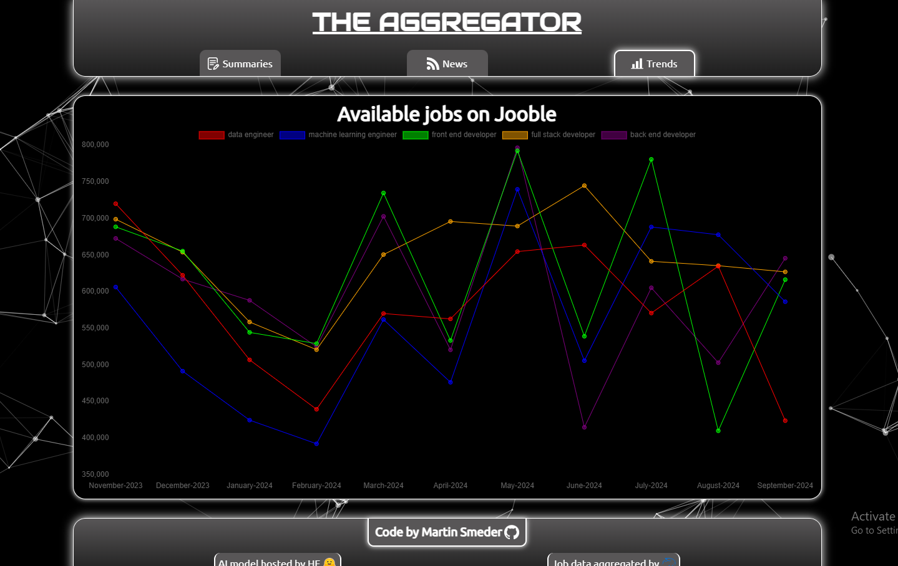

  

# The Aggregator

Live demo: https://the-aggregator.vercel.app/

An aggregator app build with JavaScript and React. Powered by Firebase, Hugging Face and Jooble.

The app has three components:

- AI summarization
- Regular RSS Feeds
- Job data

### Summaries

##### This script does the following (once a day):

1. Remove summaries older than one month from database
2. Fetch and parse RSS data from a single RSS feed
3. Summarize each articles content using the ["bart-large-cnn" AI model hosted by Hugging Face](https://huggingface.co/facebook/bart-large-cnn)
4. Adds the newly created summaries to the previously parsed data
5. Sends everything to the database

##### The frontend renders the summarized content using React

### Feeds

##### This script does the following (once a day):

1. Remove RSS data older than one month from database
2. Fetch and parse RSS data from an array of multiple RSS feeds in different categories
3. Sends the parsed RSS data to the database

##### The frontend renders the RSS data using React

### Jobs

##### This script does the following (once a month):

1. Fetch and parse job data using the Jooble API
2. Sends it to the database

##### The frontend renders the job data using React and the Recharts library
