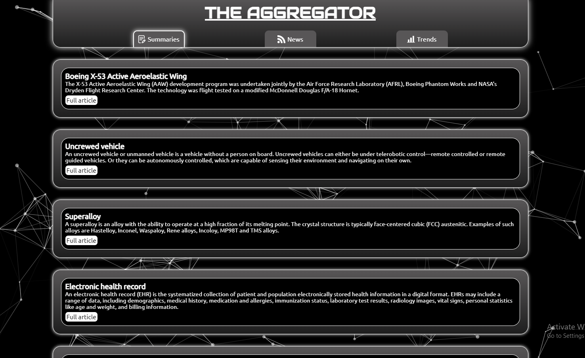
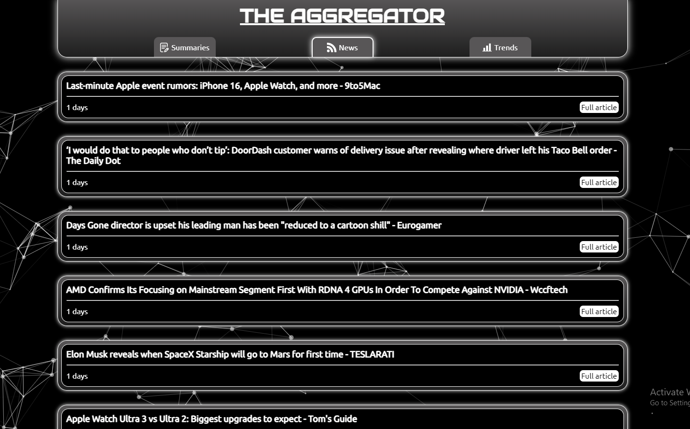

  

# The Aggregator

Live demo: https://the-aggregator.vercel.app/

An aggregator app build with JavaScript and React. Powered by Firebase, Hugging Face, Jooble and Github Actions.

The app has three components:

- AI-generated summaries of emerging technologies
- Technology-related news
- Line chart displaying job trends

### Summaries



##### This script does the following (once a day):

1. Check for new, unscraped articles on Wikipedia's "List of emerging technologies".
2. Scrape the first block of text from a random, unscraped article (if there are any).
3. Summarize the text using the ["bart-large-cnn" AI model hosted by Hugging Face](https://huggingface.co/facebook/bart-large-cnn).
4. Send the newly created summary to the database.

##### The frontend renders the summarized content using React

### News



##### This script does the following (once a day):

1. Remove news data older than one month from the database.
2. Fetch the top technology-related headlines from the past 24 hours using the News API.
3. Send the fetched news data to the database.

##### The frontend renders the RSS data using React

### Jobs


##### This script does the following (once a month):

1. Fetch and parse job data using the Jooble API.
2. Send it to the database.

##### The frontend renders the job data using React and the React ChartJS 2 library

## Setup steps

Prerequisites:

- Git installed
- Node.js installed

### 1. Clone the Repository:

Open a terminal and run the following command to clone the repository to your local machine:

```bash
git clone https://github.com/martinsmeder/the_aggregator.git
```

### 2. Navigate to the Project Directory:

Change your working directory to the project folder:

```bash
cd the_aggregator
```

### 3. Install Dependencies for Scripts Folder:

Install the project dependencies using npm:

```bash
npm install
```

### 4. Install Dependencies for Frontend Folder:

Change your working directory to the frontend folder:

```bash
cd frontend/
```

Install frontend dependencies using npm:

```bash
npm install
```

### 5. Set Up Environment Variables:

Get API keys:

- [RSS2JSON](https://rss2json.com/)
- [Hugging Face](https://huggingface.co/)
- [Jooble](https://jooble.org/api/about)

Set up environment variables:

- Create a .env file in the project root
- Use the provided .env-example file as a template
- Replace the placeholder values with your own credentials

Set up github secrets (if using github actions for automation)

- Go to you remote repo on GitHub
- Then Settings -> Secrets and variables -> Actions -> New repository secret
- Add your API keys using the same names as in the .env-example file

### 6. Configure Firebase:

1. #### Create a Firebase Project And Add a Web App:

   - Go to the [Firebase Docs](https://firebase.google.com/docs/web/setup).
   - Follow the instructions from Step 1 (Create a Firebase project &
     Register your app)

2. #### Obtain Firebase Configuration:

   - In the Firebase Console, navigate to Project Settings > General.
   - Scroll down to the "Your apps" section and find the web app you added.
   - Copy the configuration object (usually labeled as "Firebase SDK snippet") containing values like `apiKey`, `authDomain`, `projectId`, etc.

3. #### Replace Firebase Configuration in Your Project:

   - Open the `firebase-cjs.js` file in scripts folder
   - Replace the existing Firebase configuration with the one you copied from the Firebase Console
   - Repeat for `firebase.js` in frontend/src/javascript folder

4. #### Setup Firebase Testing:

   - Repeat steps 1-3 and replace the contents in the test files if you
     choose to use a second database for testing

### 7. Start Development Server:

Make sure that your are in the frontend folder by typing in the terminal:

```bash
pwd
```

If not:

```bash
cd frontend/
```

Start development server:

```bash
npm run dev
```

### 8. Testing:

- Uncomment all tests except the one you're currently testing
- In the terminal, run:

```bash
npm run test
```

## Enjoy using The Aggregator!